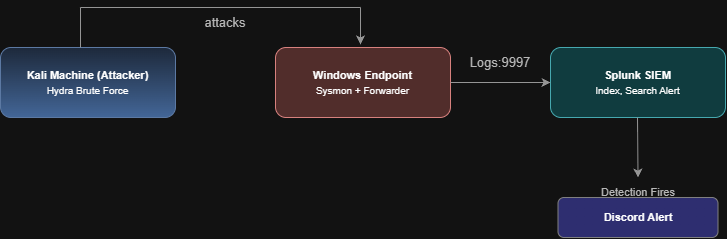
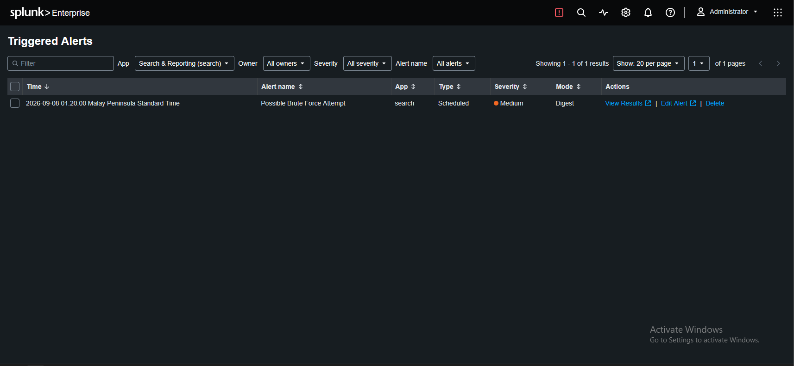
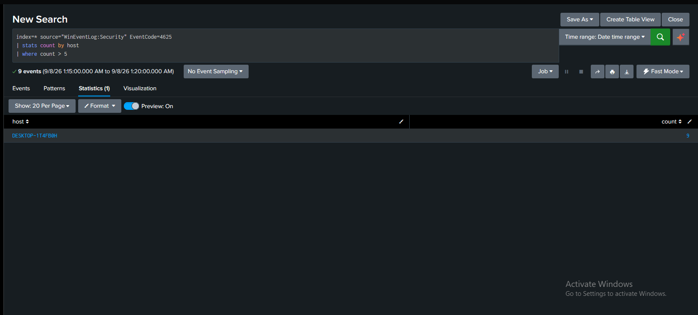
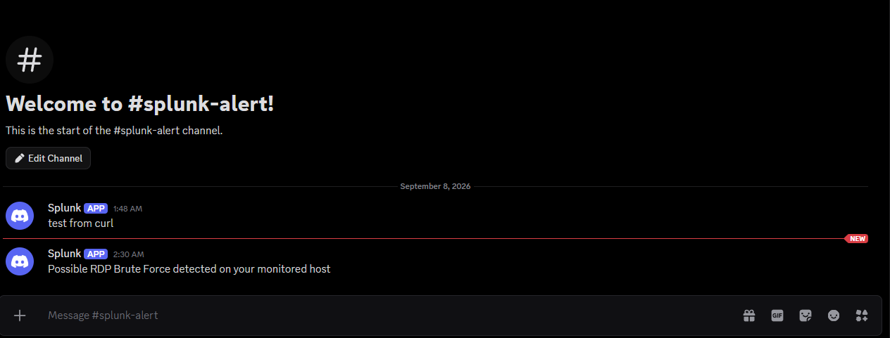

# Splunk SOC Home Lab — SIEM Detection & Alerting

A hands-on security operations home lab: utilizing Splunk as a SIEM, forwarding telemetry from a monitored Windows host, then simulating a brute-force attack, detect it with SPL, and automatically alert on it making use of notifications pushed to Discord.

**Skills demonstrated:** SIEM deployment · log forwarding · Sysmon telemetry · SPL (Search Processing Language) · basic detection engineering · scheduled alerting · Mapped detection to MITRE ATT&CK (T1110) · alert integration via webhook.

---

## Lab Architecture

Three virtual machines on an isolated host-only network:

| Role | Machine | Purpose |
|------|---------|---------|
| SIEM | Splunk Enterprise VM | Receives, indexes, and searches all logs; runs detections and alerts |
| Endpoint | Windows VM (monitored host) | The target being monitored and attacked; runs Sysmon + Universal Forwarder |
| Attacker | Kali Linux VM | Launches the simulated brute-force attack with Hydra |



---

## Phase 1: Installing Splunk

Install Splunk Enterprise, then log in on port 8000 in your preferred web browser using the credentials you made when you downloaded Splunk Enterprise.

---

## Phase 2: Loading a pre-built pile of security logs to study — BOTSv3 (Boss of the SOC v3)

- Look for the BOTSv3 repository on GitHub and download it.
- Install it as an app on your Splunk.

### Learnings from Phase 2

To identify all the sourcetypes, use the search bar to look up all the sourcetypes:

```
index="your index" | stats count by sourcetype | sort - count
```

- This searches our index, counts the sourcetypes we have, and sorts them in descending order — so the sourcetype with the most events logged is on top.
- Some sourcetypes are self-explanatory such as `linux_secure` and `WinEventLog`. Most names hint at their source, but to actually see what they are or what they contain, inspect their raw event or look them up.

**Reverse Mapping and Forward Mapping**

- Reverse mapping uses the IP to ask DNS for the hostname connected to it.
- Forward mapping uses the hostname it got from reverse mapping, then asks DNS what IP the hostname points to — to validate whether they truly match.

Verdict: a failed FCrDNS (Forward-Confirmed Reverse DNS) is not often a sign of compromise, but it is considered by some as a minor flag.

If you don't know what field to look for, you can use the field sidebar on the left side.

The workflow is always **discover → confirm → query**.

The `host` field is usually the victim, not the attacker. The constant value (e.g. a constant IP) in any event is most likely always the machine that is writing the log.

---

## Phase 3: Endpoint telemetry with Sysmon + Universal Forwarder

### Sysmon

Sysmon is a free Microsoft Sysinternals tool which logs detailed system activities on the Windows operating system — such as process creation, network connections, and any changes within files or the registry — which Windows does not normally record by default. We use Sysmon so we can get log/event information from the client being monitored by Splunk; the information logged by Sysmon is forwarded, using the Universal Forwarder, to Splunk for monitoring.

### Setup steps

1. Install Sysmon (Microsoft Sysinternals) with the "SwiftOnSecurity sysmon-config".
2. On your Splunk VM, add a new receiving port — add **9997** so Splunk can receive forwarded logs on that port.
3. Install the Splunk Universal Forwarder on the machine you want to monitor, and set it up.
4. After installing, go to `C:\Program Files\SplunkUniversalForwarder\etc\system\local` and create an `inputs.conf` file with these contents:

```
[WinEventLog://Security]
disabled = 0

[WinEventLog://Microsoft-Windows-Sysmon/Operational]
disabled = 0
```

### Breaking down the inputs.conf file

`[WinEventLog://Security]` and `[WinEventLog://Microsoft-Windows-Sysmon/Operational]` are called **stanza headers**, and they define an **input**. Inputs are where we get our data from — a source of data to collect, hence "input." `WinEventLog://` is the input type: it tells the Splunk forwarder what to read. For this instance it tells the forwarder to read the Windows Event Log, and the `Security` right next to it specifies which specific event log to read. `disabled = 0` turns the input on (0 = not disabled = active).

5. Install the Splunk app "Splunk Add-on for Sysmon". If everything is done correctly, you can now use the `index=*` command in the search bar to see if the machine you just added forwards new security events.

---

## Phase 4: Attacking the monitored client to generate logs

The attack command:

```
hydra -l <username> -P <password-list> <target-ip> <service>
```

Breaking down the Hydra command section by section:

- **`-l`** means "exact username" — used when we know the username of the client to be attacked. `-L` is used when we want the attack to use a list of possible usernames from a file. `-l` is followed by `<username>`; `-L` is followed by the `<file>`.
- **`-P <password-list>`** — refers to our payload: the file with the list of passwords Hydra will use to attack the target. This is what our brute force will use. Alternatively, `-p` (lowercase) uses only one password for guessing.
- **`<target-ip>`** — self-explanatory.
- **`<service>`** — the protocol to attack, either `rdp` (Remote Desktop) or `smb` (Server Message Block). Server Message Block is the protocol for sharing files with other devices within the same network.

Then create a `password.txt` file to serve as our payload; include false passwords along with the correct password, so we can generate logs within Splunk and see the effects of brute force on a client being monitored.

### Results of the attack — event code notes

| Event Code | Meaning |
|------------|---------|
| 4634 | account logoff |
| 5379 | Credential Manager credentials were read |
| 4672 | special privileges assigned to new logon — tells us the account that just logged in has admin-level privileges |
| 4624 | successful account logon |
| 4625 | unsuccessful account logon |

**Conclusion:** Reading the events in the correct order, we can see there were numerous failed attempts to log in to CLIENT1; after a few attempts, someone successfully logged on to CLIENT1 with privileged permissions (from the 4624 + 4672 event codes), then proceeded to read stored credentials, then logged off shortly afterwards.

From this we can conclude it does not resemble a normal user login: the "user" logged off shortly afterwards, which does not resemble a human doing work at a desk. This reflects the action of Hydra — it tested multiple passwords, and once it returned a successful login, it dropped the session.


### Detecting the brute force with SPL

```
index=* source="WinEventLog:Security" EventCode=4625
| bucket _time span=2m
| stats count by _time, host
| where count > 5
```

Dissecting the search query:

- `index=* source="WinEventLog:Security" EventCode=4625` — we choose our index, the source, and the corresponding event code that reflects failed logins.
- `| bucket _time span=2m` — bucket groups events by the condition you set; here `span=2m` means all events that happened within a 2-minute span are grouped together (that's why we get 1 result — without bucket, those events would be displayed separately).
- `| stats count by _time, host` — groups the events by time bucket and host and counts how many fall in each group.
- `| where count > 5` — keeps only groups where the count from the previous pipe is greater than 5.

**Conclusion:** In a span of 2 minutes there were more than 5 failed login attempts — specifically 6 within 2 minutes or less. This does not resemble a human failed login; 6 failed password attempts in 2 minutes is not humanly likely unless a user intentionally spammed wrong passwords.

---

## Phase 5: Creating alerts instead of relying on manual searches

Using the result from Phase 4, save the search query as an alert. Either the time-bucketed version, or a simpler version that doesn't use time:

```
index=* source="WinEventLog:Security" EventCode=4625
| stats count by host
| where count > 5
```

On the top right of the search, save the query as an alert, and add a title and description.

**MITRE ATT&CK mapping —** T1110 is the technique associated with brute-force attacks. This includes:

- T1110.001: Password Guessing
- T1110.002: Password Cracking
- T1110.003: Password Spraying
- T1110.004: Credential Stuffing

Set the **time range to Last 5 minutes** — the alert runs every 5 minutes and looks at all failed logons within that timeframe that exceeded 5 attempts. The "more than 5" condition comes from the saved search query (`| where count > 5`).

For **trigger actions**, we used "Add to Triggered Alerts" — every time the alert fires, we can see it in the Triggered Alerts section.

### Testing the alert

Back on the Kali VM, simulate a brute-force attack on the RDP of CLIENT1 again using Hydra. Then return to the Splunk SIEM and check whether the alert caught the attempt.

In the Alerts tab we can see the alert caught a possible brute-force attempt. Expanding it with **View Results** shows what the alert found: the monitored client recorded 9 failed attempts within 5 minutes.





### Detection summary

| Detection | Data source | Logic (SPL) | MITRE ATT&CK |
|-----------|-------------|-------------|--------------|
| RDP / logon brute force | `WinEventLog:Security` (EventCode 4625) | `stats count by host \| where count > 5` (rolling 5-min window) | T1110 — Brute Force |

---

## Notifying an analyst — Discord webhook integration

Instead of manually checking the Triggered Alerts tab, we push notifications automatically via a webhook. For this scenario, Discord receives the triggered alerts from Splunk.

First, get a webhook from your Discord channel. Then, in Splunk, edit the alert.

Here we use the **Run a script** action, because a direct Splunk-to-Discord webhook is unreliable — Discord requires a `content` field. So we still use the webhook, but through a script that sends the alert to our Discord channel.

The script:

```bat
curl -H "Content-Type: application/json" -d "{\"content\": \"Possible RDP Brute Force detected on your monitored host\"}" "<YOUR_DISCORD_WEBHOOK_URL>"
```

Dissecting the script:

- **`curl`** — also known as client URL, a command-line tool that sends web requests. In our case it sends data to Discord through our webhook.
- **`-H "Content-Type: application/json"`** — the header, telling Discord that the content we're sending is in JSON format. This is needed so Discord knows how to read the message.
- **`-d "{...}"`** — the data we're sending: the content we want to appear in Discord from our Splunk SIEM. The `content` field holds whatever text Discord displays.
- The format looks the way it does because **JSON requires a "key": "value" pair**, wrapped in curly brackets — `{"key": "value"}`. In our case that's `{"content": "Possible RDP Brute Force detected..."}`.
- The multiple **backslashes** are used to escape the quotation marks. Because the JSON (which uses quotes) is nested inside curl's own quoted `-d` argument, each inner quote must be escaped with `\` so it's treated as a literal character and the command runs correctly. (The URL keeps plain quotes because it isn't nested inside another quoted string.)

### Wiring the script into the alert

1. Create a `.bat` script in Splunk's `bin\scripts` folder (`C:\Program Files\Splunk\bin\scripts` — create the `scripts` folder if it doesn't exist).
2. In the alert's trigger actions, select **Run a script** and choose the `.bat` file you just made.

Once set up, you receive a message on your Discord, and you now have a fully working alert notification system.



---

## Key takeaways

This lab demonstrates a complete detection workflow end to end: collecting endpoint telemetry (Sysmon + Windows Event Logs), forwarding it to a SIEM, writing detection logic in SPL, distinguishing an automated attack from normal user behaviour (time-clustered failure volume, not raw counts), turning that logic into a scheduled alert mapped to MITRE ATT&CK (T1110), and routing the notification to where an analyst would see it. It reflects the core skills behind SOC detection and monitoring, built hands-on in an isolated lab.

---

## ⚠ Security & scope note

All attacks in this lab were performed against machines I own, inside an isolated host-only virtual network. Brute-force tooling should only ever be used against systems you have explicit permission to test. The Discord webhook URL in this documentation is a placeholder — the real URL is a live credential and is not committed to this repository.
